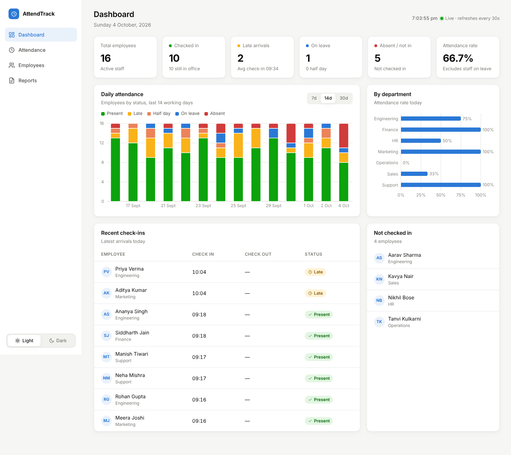
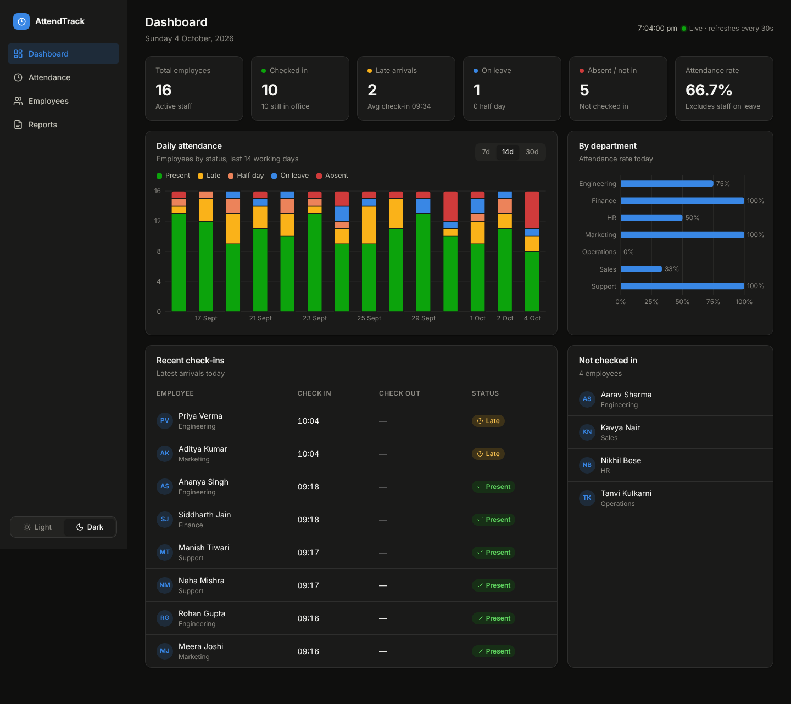
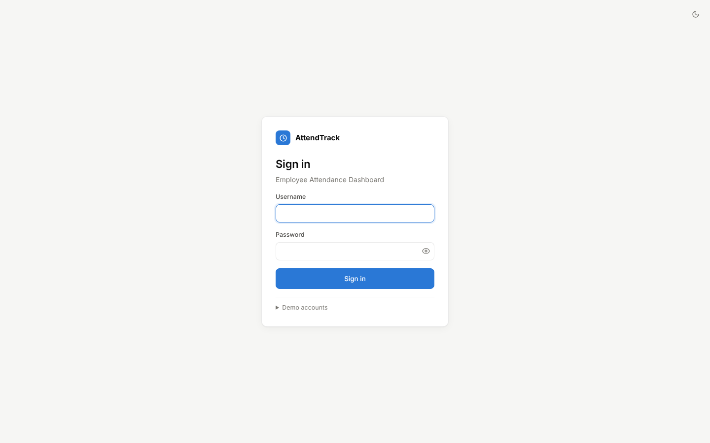
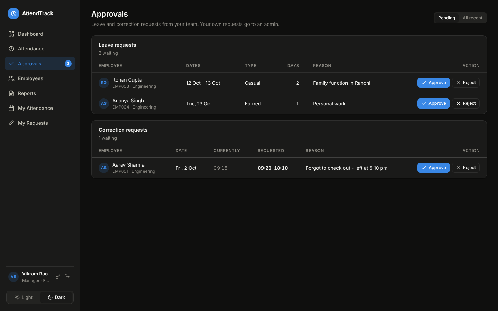
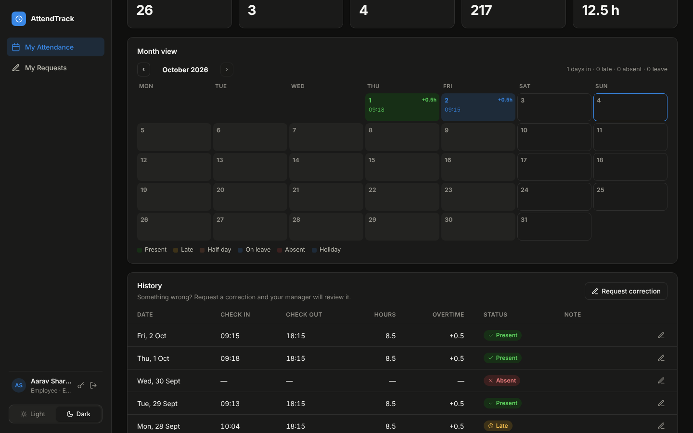
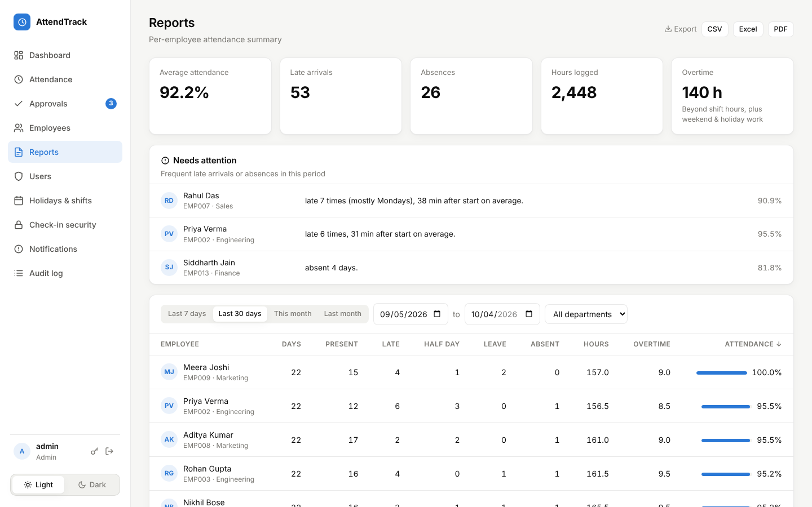
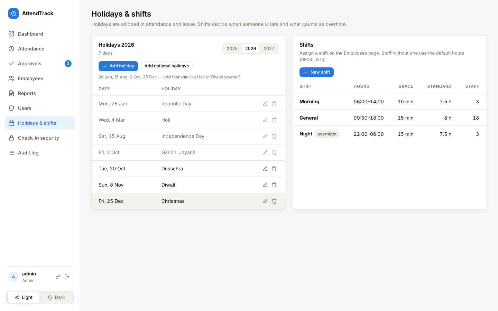
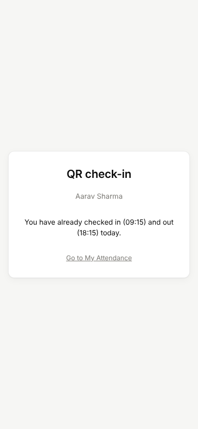

# Employee Attendance Dashboard

Track employee attendance with a Spring Boot REST API and a React dashboard that has **light and dark mode**.

| Light | Dark |
|---|---|
|  |  |

**Quick start:** `docker compose up -d --build` (see [Run with Docker](#run-with-docker)), or `.\start-dev.ps1` on Windows for development.

## Features

- **Dashboard** – live KPIs (checked in, late, on leave, absent, attendance rate), a stacked daily-status chart (7/14/30 days), department attendance rates, recent check-ins and who hasn't arrived yet. Auto-refreshes every 30 seconds.
- **Attendance** – one-click check-in / check-out for today; pick any past date to correct a record, mark leave or absence, or add a note.
- **Employees** – add, edit, deactivate or delete employees; view each person's last 30 days.
- **Reports** – per-employee summary for any date range (present, late, half day, leave, absent, hours, %), sortable, filter by department, **export to CSV**.
- **Light / Dark mode** – toggle in the sidebar; follows your OS setting on first visit and remembers your choice.
- **Login & roles** – Spring Security + JWT. Admins see everything, managers see only their department, employees see only their own attendance.
- **Account security** – BCrypt password hashing, lockout after 5 wrong passwords (15 min), password policy, change/reset password (signs out old sessions).
- **Audit log** – every sign-in, failed login, lockout and data change is recorded with user, time and IP.
- **Self check-in** – employees and managers check themselves in/out from **My Attendance**.
- **Leave requests** – apply for Casual (12/yr), Sick (10/yr), Earned (15/yr) or Unpaid leave; balance shown live; manager approves/rejects (rejection needs a reason); approved leave marks the days as *On leave*; upcoming approved leave can be cancelled.
- **Correction requests** – "I forgot to check out": employee sends the real times, manager approves and the record is updated.
- **Approvals** – queue with a badge count for managers (own department) and admins. Nobody can approve their own request.
- **Check-in security** (admin → *Check-in security*) – stop "buddy punching" on self check-in, combine any of:
  - **Rotating QR code** – open the **Kiosk screen** on an office monitor/tablet; it shows a QR + 6-digit code that changes every 30 s (HMAC-based, like an authenticator app). Employees scan it with their phone or type the code. 5 wrong codes → blocked for 10 min.
  - **Geofence** – the phone's GPS must be within *N* metres of the office ("Use my current location" to set it).
  - **Office network** – only allowed IPs / CIDR ranges. `X-Forwarded-For` is only trusted from local proxies (`attendance.security.trusted-proxies`), so it can't be spoofed from outside.
  - Every blocked attempt is written to the audit log as *Check-in rejected*; each record shows how it was verified (e.g. `Self · IP 192.168.1.20 · GPS 42 m · QR`).

- **Holidays** (admin → *Holidays & shifts*) – holidays are not working days: nobody is marked absent, leave over a holiday doesn't use balance, and reports skip them. "Add national holidays" adds 26 Jan, 15 Aug, 2 Oct and 25 Dec; add festivals (Holi, Diwali, Eid…) yourself since their dates change yearly.
- **Shifts** – Morning 06:00–14:00, General 09:30–18:00 and Night 22:00–06:00 are created on first start; add your own. Assign one per employee on the Employees page. *Late* is judged against the employee's shift start + grace; night shifts may check out after midnight. Staff without a shift use `attendance.office-start` and `attendance.standard-hours`.
- **Overtime** – hours beyond the shift's standard hours; every hour on a weekend or holiday counts as overtime. Shown on My Attendance, in Reports and in the CSV export.

- **Month calendar** – every employee's month as a coloured grid (My Attendance, and the calendar icon on the Employees page) with times, overtime and holidays.
- **Excel & PDF export** – Reports → Export → CSV / Excel / PDF (Apache POI and OpenPDF). Managers export only their department.
- **Needs attention** – Reports highlights people late or absent ≥ 3 times in the period, e.g. *"late 7 times (mostly Mondays), 38 min after start on average"* (`attendance.alerts.late-threshold`).
- **Email alerts** (admin → *Notifications*):
  - Missing check-in reminder on working days (10:30 by default, shift-aware, once per person per day)
  - Weekly summary to each manager for their department (Mondays 09:00) and optionally to `attendance.alerts.admin-email`
  - Managers are emailed about new leave requests; employees about approved/rejected leave and corrections
  - Without SMTP settings, emails are only stored in the Notifications log (status *Logged*) – use "Send … now" to try them. To send for real, uncomment the `spring.mail.*` lines in `application.properties` (for Gmail use an App Password) and set `MAIL_USERNAME` / `MAIL_PASSWORD` environment variables. With Docker, set `MAIL_HOST` etc. in `.env`.

- **Production ready** – MySQL via the `prod` profile, everything configured by environment variables, Docker Compose (MySQL + backend + nginx), health check at `/actuator/health`, the backend refuses to start in prod without a `JWT_SECRET`, and no default admin password in prod. See [DEPLOYMENT.md](DEPLOYMENT.md).

### Testing QR / GPS check-in on a phone

Phones only allow the camera and GPS on **https** pages, so start the frontend in phone mode:

```powershell
cd frontend
npm install          # first time (adds the QR + https plugins)
npm run dev:phone
```

It prints a `Network: https://192.168.x.x:5173/` address. Open that on your phone (same Wi-Fi), accept the certificate warning (it's a local self-signed certificate), log in as `employee` and scan the kiosk QR shown on your PC at `/kiosk`.
If Windows Firewall asks, allow Node.js on private networks.

### Accounts & roles

| Username | Password | Role | Can access |
|---|---|---|---|
| `admin` | `Admin@123` | Admin | Everything, plus Users and Audit log |
| `manager` | `Manager@123` | Manager (Vikram Rao) | Dashboard, attendance, employees and reports for **Engineering** only, plus their own attendance |
| `employee` | `Employee@123` | Employee (Aarav Sharma) | **My Attendance** only |

These are created on first start. **Change the admin password** after logging in (key icon at the bottom of the sidebar).
For real use, set environment variables before starting the backend:

```powershell
$env:JWT_SECRET = "a-long-random-string-of-at-least-32-characters"
$env:ADMIN_PASSWORD = "YourStrongPassword1"
mvn spring-boot:run
```

### Attendance rules (change in `application.properties`)

| Rule | Default |
|---|---|
| Office start | 09:30 |
| Late after | start + 15 min grace (09:45) |
| Half day | worked less than 4.5 h |
| Weekend | Saturday, Sunday (excluded from reports) |

## Tech stack

| Layer | Tech |
|---|---|
| Backend | Java 17+, Spring Boot 3.3, Spring Security, JWT (jjwt), Spring Data JPA, Bean Validation, Spring Mail, Apache POI, OpenPDF |
| Database | H2 (file-based, `backend/data/`) for development, MySQL 8 in production |
| Deployment | Docker, Docker Compose, nginx, Spring Boot Actuator |
| Frontend | React 18, Vite 5, React Router, Recharts |

## Project structure

```
attendance-dashboard/
├── docker-compose.yml               MySQL + backend + frontend (nginx)
├── .env.example                     Settings for Docker (copy to .env)
├── DEPLOYMENT.md                    Server, HTTPS, backups, updates
├── start-dev.ps1                    Windows: start backend + frontend for development
├── docs/screenshots/
├── backend/                         Spring Boot API (port 8080) + Dockerfile
│   └── src/main/java/com/cecil/attendance/
│       ├── model/        Employee, AttendanceRecord, AttendanceStatus
│       ├── repository/   Spring Data JPA repositories
│       ├── service/      EmployeeService, AttendanceService, ReportService
│       ├── controller/   REST controllers
│       ├── dto/          Request/response records
│       ├── config/       Properties, CORS, Clock, demo DataSeeder, UserSeeder
│       ├── security/     SecurityConfig, JwtService, JwtAuthFilter, AccessGuard, PasswordPolicy
│       └── exception/    ApiException + global error handler
└── frontend/                        React app (port 5173) + Dockerfile, nginx.conf
    └── src/
        ├── pages/        Dashboard, Attendance, Employees, Reports
        ├── components/   StatusBadge, Modal, Toast, Icons, ...
        ├── theme.jsx     Light/dark theme context + chart colors
        └── index.css     Theme tokens (CSS variables) and styles
```

## Screenshots

| | |
|---|---|
|  **Login** |  **Manager approvals** |
|  **Kiosk with rotating QR** |  **My month calendar** |
|  **Reports with Excel/PDF export** |  **Holidays & shifts** |

<p align="center"><br><b>QR check-in on a phone</b></p>

## Run with Docker

Needs only **Docker Desktop**. This starts MySQL, the Spring Boot API and the React app behind nginx:

```powershell
Copy-Item .env.example .env     # then open .env and change every CHANGE_ME
docker compose up -d --build
```

Open **http://localhost** and log in as `admin` with the `ADMIN_PASSWORD` you set.
Data is kept in a Docker volume between restarts. For a real server, HTTPS, backups and updates, see **[DEPLOYMENT.md](DEPLOYMENT.md)**.

## How to run (development)

You need **JDK 17+**, **Maven** (or IntelliJ IDEA) and **Node.js 18+**.

**Windows shortcut:** run `.\start-dev.ps1` in the project folder. It opens two windows (backend + frontend) and frees port 8080 if an old backend is still running.

### 1. Backend

```bash
cd backend
mvn spring-boot:run
```

Or in IntelliJ: open the `backend` folder → run `AttendanceApplication`.

The first run creates 24 demo employees and ~6 weeks of attendance history.
H2 console: http://localhost:8080/h2-console (JDBC URL `jdbc:h2:file:./data/attendance-db`, user `sa`, no password).

Run the tests with `mvn test`.

### 2. Frontend (new terminal)

```bash
cd frontend
npm install
npm run dev
```

Open **http://localhost:5173**. Vite forwards `/api` calls to the backend on port 8080.

> To reset the demo data, stop the backend and delete the `backend/data` folder.

## REST API

All endpoints except login need the header `Authorization: Bearer <token>`.

| Method | Endpoint | Purpose |
|---|---|---|
| POST | `/api/auth/login` | Get a JWT `{username, password}` |
| GET | `/api/auth/me` | Current user |
| POST | `/api/auth/change-password` | Change own password (returns a new token) |
| GET | `/api/me/attendance?from=&to=` | Own attendance history |
| GET / POST / PUT / DELETE | `/api/users[/{id}]` | Manage accounts (admin) |
| POST | `/api/users/{id}/reset-password` | Reset a user's password (admin) |
| GET | `/api/audit?username=&action=&page=` | Audit log (admin) |
| POST | `/api/me/check-in`, `/api/me/check-out` | Self check-in / check-out |
| GET | `/api/me/leave-balance` | Own leave balance for the year |
| GET / POST | `/api/me/leave-requests` | Own leave requests / apply |
| POST | `/api/me/leave-requests/{id}/cancel` | Cancel own pending or upcoming leave |
| GET / POST | `/api/me/corrections` | Own correction requests / request one |
| GET | `/api/approvals/count` | Pending counts (manager/admin) |
| GET | `/api/approvals/leave?status=PENDING\|ALL` | Leave approval queue |
| POST | `/api/approvals/leave/{id}` `{approve, comment}` | Approve / reject leave |
| GET / POST | `/api/approvals/corrections[/{id}]` | Correction queue / review |
| GET | `/api/me/checkin-policy` | Which proofs self check-in needs |
| GET / PUT | `/api/settings/checkin` | Check-in security rules (admin) |
| GET | `/api/settings/client-ip` | IP the server sees for you (admin) |
| GET | `/api/kiosk/code` | Current rotating QR code (admin/manager) |
| GET | `/api/holidays?year=` | Holidays for a year (everyone) |
| POST / PUT / DELETE | `/api/holidays[/{id}]` | Manage holidays (admin) |
| POST | `/api/holidays/national?year=` | Add fixed national holidays (admin) |
| GET / POST / PUT / DELETE | `/api/shifts[/{id}]` | List (admin/manager) / manage shifts (admin) |
| GET | `/api/reports/summary.xlsx`, `/summary.pdf` `?from=&to=` | Excel / PDF report |
| GET | `/api/reports/patterns?from=&to=` | Frequent late/absent ("needs attention") |
| GET | `/api/me/calendar?month=YYYY-MM` | Own month calendar |
| GET | `/api/employees/{id}/calendar?month=YYYY-MM` | An employee's month calendar (admin/manager) |
| GET | `/api/notifications`, `/settings` | Email outbox and alert settings (admin) |
| POST | `/api/notifications/run/missing-checkin`, `/run/weekly-summary` | Run an alert now (admin) |
| GET | `/api/employees?activeOnly=false` | List employees |
| GET | `/api/employees/departments` | Department names |
| POST / PUT / DELETE | `/api/employees[/{id}]` | Create / update / delete employee |
| GET | `/api/employees/{id}/attendance?from=&to=` | One employee's history |
| GET | `/api/attendance?date=YYYY-MM-DD` | Daily board (all active employees) |
| POST | `/api/attendance/check-in` `{employeeId}` | Check in now |
| POST | `/api/attendance/check-out` `{employeeId}` | Check out now |
| PUT | `/api/attendance` | Create/correct a record for any past date |
| DELETE | `/api/attendance/{id}` | Clear a record |
| GET | `/api/reports/stats?date=` | KPI numbers |
| GET | `/api/reports/trend?days=14` | Daily status counts |
| GET | `/api/reports/departments?date=` | Department rates |
| GET | `/api/reports/summary?from=&to=` | Per-employee summary |
| GET | `/api/reports/summary.csv?from=&to=` | Same, as CSV download |

## Production profile (MySQL)

Development uses H2 with no setup. Production uses the `prod` profile (`application-prod.properties`), and every setting comes from environment variables:

| Variable | Meaning |
|---|---|
| `SPRING_PROFILES_ACTIVE=prod` | Turns on the production settings |
| `DB_URL`, `DB_USERNAME`, `DB_PASSWORD` | MySQL connection |
| `JWT_SECRET` | 32+ random characters. **Required**: the app won't start without it |
| `ADMIN_PASSWORD` | First admin password. If empty, a random one is printed once in the log |
| `SEED_DEMO_DATA` | `true` to add demo employees (default `false` in prod) |
| `CORS_ORIGINS`, `TRUSTED_PROXIES` | Allowed web origin, and which proxies may set `X-Forwarded-For` |
| `SPRING_MAIL_HOST`, `SPRING_MAIL_USERNAME`, `SPRING_MAIL_PASSWORD`, `MAIL_FROM`, `ADMIN_EMAIL` | Email (optional) |

In prod, the H2 console is off, error responses don't include stack traces, and only `/actuator/health` is public. Docker Compose sets all of this for you. To run the jar by hand, see [DEPLOYMENT.md](DEPLOYMENT.md#6-running-the-prod-profile-without-docker).
