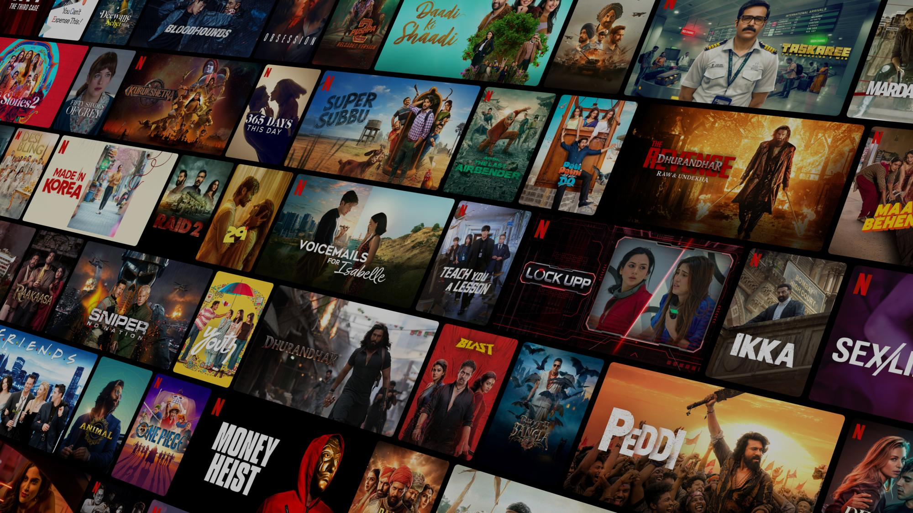

# 🎬 Netflix Clone

A responsive **Netflix-inspired landing page** built using **HTML and Tailwind CSS**. This project recreates the look and feel of Netflix's homepage with a modern dark-themed interface, responsive layouts, call-to-action sections, FAQ accordion, and footer navigation.

> 🚀 This project was created for learning and practicing frontend web development and responsive UI design.

## 🌐 Live Demo

**Live Demo:** Add your deployed Vercel/Netlify URL here.

## 📸 Project Preview



## ✨ Features

* 🎬 Netflix-inspired homepage design
* 📱 Responsive layout for different screen sizes
* 🌑 Dark-themed Netflix-style UI
* 🌄 Full-screen hero/banner section
* 🔴 Netflix-style call-to-action buttons
* 📧 Email input section
* ▶️ Watch Now section
* ❓ Interactive FAQ accordion
* 🌐 Language selection dropdown
* 📌 Responsive footer section
* ⚡ Tailwind CSS utility-based styling

## 🛠️ Technologies Used

* **HTML5**
* **Tailwind CSS**
* **JavaScript**
* **Responsive Web Design**

Tailwind CSS is loaded using the Tailwind browser CDN in the project.

## 📂 Project Structure

```text
Netflix-Clone/
│
├── index.html
├── images/
│   ├── homePage.jpg
│   ├── lap.jpg
│   └── watch.jpg
│
└── README.md
```

## 🎨 Main Sections

### 🏠 Hero Section

The homepage starts with a full-screen Netflix-inspired banner containing:

* Netflix logo
* Language selector
* Sign In button
* Main heading
* Email input
* Get Started button

The hero section uses a background image with a dark overlay to create the Netflix-style appearance.

### ▶️ Watch Now Section

A dedicated Watch Now section provides a call to action along with visual content using laptop and watch-related images.

### ❓ FAQ Section

The project includes an interactive Frequently Asked Questions section.

Users can click questions to expand or collapse the answers. JavaScript handles the accordion behavior and automatically closes other questions when a new question is opened.

### 🦶 Footer

The footer contains Netflix-style navigation links such as:

* FAQ
* Help Centre
* Account
* Jobs
* Privacy
* Contact Us
* Terms of Use
* Legal Notices

It also includes language selection and Netflix India branding.

## 🚀 Getting Started

### 1. Clone the Repository

```bash
git clone https://github.com/cecilbaraik/Netflix-Clone.git
```

### 2. Navigate to the Project

```bash
cd Netflix-Clone
```

### 3. Run the Project

Since this is a frontend HTML project, you can simply open:

```text
index.html
```

in your browser.

Alternatively, use the **Live Server** extension in VS Code.

## 📱 Responsive Design

The website uses Tailwind CSS responsive utility classes to adapt the layout for:

* 📱 Mobile devices
* 📲 Tablets
* 💻 Laptops
* 🖥️ Desktop screens

## 📚 What I Learned

Through this project, I practiced:

* Building responsive layouts with HTML
* Using Tailwind CSS utility classes
* Creating full-screen hero sections
* Working with background images and overlays
* Creating responsive grids and flex layouts
* Implementing interactive FAQ accordions with JavaScript
* Structuring a multi-section landing page
* Improving frontend UI/UX

## 🔮 Future Improvements

* Add React.js implementation
* Add movie browsing functionality
* Add authentication
* Add movie search
* Integrate a movie API
* Add movie categories
* Add user profiles
* Add watchlist functionality
* Add backend functionality
* Deploy the project with a custom domain

## 👨‍💻 Author

**Cecil Baraik**

* GitHub: https://github.com/cecilbaraik
* LinkedIn: https://linkedin.com/in/cecil-baraik-b8150b339
* Portfolio: https://cecilbaraik19-portfolio.vercel.app

## ⚠️ Disclaimer

This project is a **Netflix-inspired educational project** created for learning and portfolio purposes. It is not affiliated with or endorsed by Netflix.

---

⭐ If you found this project useful, consider giving the repository a star!
